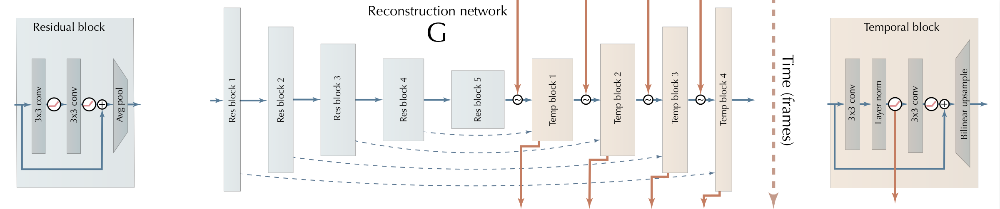

# Deep Fovea Architecture for Video Super Resolution

This repository tries to solve the task of fovea sampled reconstruction and video super resolution with main 
architecture of the [Deep Fovea](https://research.fb.com/wp-content/uploads/2019/11/DeepFovea-Neural-Reconstruction-for-Foveated-Rendering-and-Video-Compression-using-Learned-Statistics-of-Natural-Videos.pdf?) 
paper by Anton S. Kaplanyan et al. (facebook research).

## Model Architecture

[Source](https://github.com/facebookresearch/DeepFovea)

To reach the desired super-resolution (4 times higher than the input) two additional blocks are used, in the end of the 
generator network. This so called super-resolution blocks are based on two (for the final block three) 
[deformable convolutions](https://arxiv.org/abs/1811.11168) and an bilinear upsampling.

## Losses

We applied the same losses as the paper, but we also added a supervised loss. For this supervised loss, the adaptive 
robust loss function by Jonathan T. Barron was chosen.

We compute each loss independent, since otherwise we run into a VRAM issue (Tesla V100 16GB).

## Dependencies

This implementation used the [adaptive robust loss](https://arxiv.org/abs/1701.03077) 
[implementation](https://github.com/jonbarron/robust_loss_pytorch) 
by [Jonathan T. Barron](https://github.com/jonbarron/robust_loss_pytorch). Furthermore, 
[deformable convolutions V2](https://arxiv.org/abs/1811.11168) are used in the generator network. 
Therefor the [implementation](https://github.com/chengdazhi/Deformable-Convolution-V2-PyTorch/tree/pytorch_1.0.0) 
of [Dazhi Cheng](https://github.com/chengdazhi) is utilized.
For the [PWC-Net](https://github.com/NVlabs/PWC-Net/tree/master/PyTorch) 
the implementation and pre-trained weights of [Nvidia Research](https://github.com/NVlabs) is used. 
Additionally the PWC-Net and the flow loss implementation depends on the 
[correlation](https://github.com/NVIDIA/flownet2-pytorch/tree/master/networks/correlation_package), and 
[resample](https://github.com/NVIDIA/flownet2-pytorch/tree/master/networks/resample2d_package) package 
of the PyTorch [FlowNet2](https://github.com/NVIDIA/flownet2-pytorch/tree/master/networks) 
implementation by Nvidia. To install the packages run `python setup.py install` for each package. The setup.py file
is located in the corresponding folder.

All additional required packages can be found in [requirements.txt](requirements.txt).
To install the additional required packages simply run `pip install -r requirements.txt`.

## Results

Results of the training run started at the 02.05.2020. For this training run the recurrent tensor of each temporal block 
was reset after each full video.

We sampled approximately 19% of the low resolution (192 X 256) input image, when apply the fovea sampling. This 19% 
corresponds to 1.2% when compared to the high resolution (768 X 1024) label.

Low resolution (192 X 256) fovea sampled input image

High resolution (768 X 1024) reconstructed prediction of the generator

High resolution (768 X 1024) label

The corresponding pre-trained models, additional plots and all metrics can be found in the folder: `results/2020-05-02`