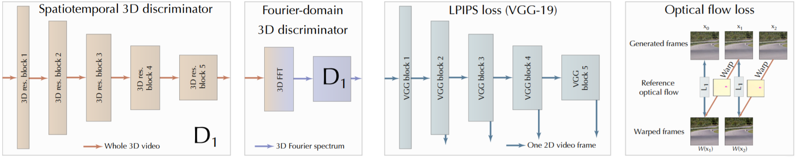

# Deep Fovea Architecture for Video Super Resolution

This repository tries to solve the task of video super resolution with main architecture of the 
[Deep Fovea](https://research.fb.com/wp-content/uploads/2019/11/DeepFovea-Neural-Reconstruction-for-Foveated-Rendering-and-Video-Compression-using-Learned-Statistics-of-Natural-Videos.pdf?) 
paper by Anton S. Kaplanyan et al. (facebook research).

## TODO

* **Done** (REDS ~40GB) Find dataset ([youtube 8M](https://research.google.com/youtube8m/), [cityscapes](https://www.cityscapes-dataset.com/) or [REDS](https://seungjunnah.github.io/Datasets/reds.html))
* **Done** Implement dataset class for chosen dataset
* **Done** Implement [PSNR](https://en.wikipedia.org/wiki/Peak_signal-to-noise_ratio) and [SSIM](https://en.wikipedia.org/wiki/Structural_similarity)
* **Done** Implement validation method (L1, L2, PSNR and SSIM)
* Implement test method
* **Done** Implement inference method
* Analyse results and HPO if needed ;)

## Dependencies

This implementation used the [adaptive robust loss](https://arxiv.org/abs/1701.03077) 
[implementation](https://github.com/jonbarron/robust_loss_pytorch) 
by [Jonathan T. Barron](https://github.com/jonbarron/robust_loss_pytorch). Furthermore, 
[deformable convolutions V2](https://arxiv.org/abs/1811.11168) are used in the generator network. 
Therefor the [implementation](https://github.com/chengdazhi/Deformable-Convolution-V2-PyTorch/tree/pytorch_1.0.0) 
of [Dazhi Cheng](https://github.com/chengdazhi) is utilized.

All required packages can be found in [requirements.txt](requirements.txt).

To install all dependencies simply run `pip install -r requirements.txt`

## Model Architecture

[Source](https://github.com/facebookresearch/DeepFovea)
